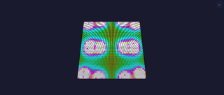
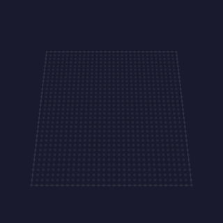

# Modifiers

Every modifier, one block each: its preview, what it does, and what each control means, together. A modifier sits between an [effect](effects.md) and the output: it reshapes *where* pixels land (or masks them) without changing the effect's drawing. Modifiers compose: a [Layer](moxygen/Layer.md) folds its whole modifier stack each rebuild; a *dynamic* modifier (one that overrides `modifyLive`) also runs a per-frame pass, and an *animated* one keeps a static fold but rebuilds it on its own clock. See [ModifierBase](moxygen/ModifierBase.md) for the static-vs-dynamic split. Each block's emoji are its `tags()` (see the [tag emoji legend](../../explanation/architecture/index.md#tag-emoji-legend)); **Kind** is static (baked into the mapping at rebuild) or dynamic (per-frame remap). Modifiers are grouped into sections, and each block carries that modifier's preview, behavior, and control descriptions together. (For how this page maps to the source/asset folders, see the [folder-structure decision](../../contributing/documentation-standards.md#module-pages).)

A modifier folds coordinates rather than drawing, so it reaches for very little of the shared [power function](power-functions.md) toolbox — that page states the split and lists which modifiers use what.

## MoonLight modifiers

<a id="block"></a>

### Block 💫 · static


Expands a 1D effect into concentric **square rings** (Chebyshev distance from the center): the effect's linear position becomes the ring index, so a gradient effect draws nested squares.

Origin: MoonLight · via [MoonLight](https://github.com/MoonModules/projectMM/blob/main/src/MoonLight/Nodes/Modifiers/M_MoonLight.h)

Detail: [technical](moxygen/BlockModifier.md)

[Tests](../../reference/tests/unit-tests.md#blockmodifier)

<a id="checkerboard"></a>

### Checkerboard 💫 · static


Masks the layer in a checkerboard: "off" squares are dropped, "on" squares pass through unchanged.

- `size` — checker square edge in lights (1–64).
- `invert` — flip which squares pass through vs are masked.

Origin: MoonLight · by WildCats08 / [@Brandon502](https://github.com/Brandon502) · via [MoonLight](https://github.com/MoonModules/projectMM/blob/main/src/MoonLight/Nodes/Modifiers/M_MoonLight.h)

Detail: [technical](moxygen/CheckerboardModifier.md)

[Tests](../../reference/tests/unit-tests.md#checkerboardmodifier)

<a id="circle"></a>

### Circle 💫 · static


Expands a 1D effect into concentric **circular rings** (Euclidean distance from the center): the effect's linear position becomes the radius, so a gradient effect draws nested circles. The circular counterpart to [Block](#block).

Origin: MoonLight · via [MoonLight](https://github.com/MoonModules/projectMM/blob/main/src/MoonLight/Nodes/Modifiers/M_MoonLight.h)

Detail: [technical](moxygen/CircleModifier.md)

[Tests](../../reference/tests/unit-tests.md#circlemodifier)

<a id="mirror"></a>

### Mirror 💫 · static



Folds the far half of the box back onto the near half per axis, mirroring the image across the box center (top-left quadrant reflected into the others in 2D, near octant into all eight in 3D).

- `mirrorX` / `mirrorY` / `mirrorZ` — mirror across the center on that axis.

Origin: MoonLight · via [MoonLight](https://github.com/MoonModules/projectMM/blob/main/src/MoonLight/Nodes/Modifiers/M_MoonLight.h)

Detail: [technical](moxygen/MirrorModifier.md)

[Tests](../../reference/tests/unit-tests.md#mirrormodifier)

<a id="multiply"></a>

### Multiply 💫 · static


Tiles the logical image across the box `multiply` times per axis, optionally mirroring alternate tiles (a pure mirror is `multiply = 2, mirror = true`).

- `multiplyX` / `multiplyY` / `multiplyZ` — tiles per axis, `1` meaning none.
- `mirrorX` / `mirrorY` / `mirrorZ` — reflect alternate tiles on that axis.

Origin: MoonLight · via [MoonLight](https://github.com/MoonModules/projectMM/blob/main/src/MoonLight/Nodes/Modifiers/M_MoonLight.h)

Detail: [technical](moxygen/MultiplyModifier.md)

[Tests](../../reference/tests/unit-tests.md#multiplymodifier)

<a id="pinwheel"></a>

### Pinwheel 💫 · static


Remaps the grid into radial **petals** around the center — the angle to each pixel picks its petal, with an optional swirl (angle sheared by radius), symmetry, and z-twist. Turns a linear or 2D effect into a rotating flower/spokes pattern.

- `petals` — number of petals radiating from the center.
- `swirl` — shear the angle by radius (−127..127; a spiral; negative reverses).
- `reverse` — reverse the petal order.
- `symmetry` — fold the petals into a factor-of-360 symmetry.
- `zTwist` — twist the petals along z (3D).

Origin: MoonLight · via [MoonLight](https://github.com/MoonModules/projectMM/blob/main/src/MoonLight/Nodes/Modifiers/M_MoonLight.h)

Detail: [technical](moxygen/PinwheelModifier.md)

[Tests](../../reference/tests/unit-tests.md#pinwheelmodifier)

<a id="ripplexz"></a>

### RippleXZ 💫 · static



Collapses an axis to a single plane so a higher-dimensional effect ripples along the remaining axes — used to drive a 1D→2D/3D ripple.

- `shrink` — collapse the selected axis (on = collapse).
- `towardsX` / `towardsZ` — which axis collapses to a single line.

Origin: MoonLight · by @Troy (WLEDMM Art-Net) · via [MoonLight](https://github.com/MoonModules/projectMM/blob/main/src/MoonLight/Nodes/Modifiers/M_MoonLight.h)

Detail: [technical](moxygen/RippleXZModifier.md)

[Tests](../../reference/tests/unit-tests.md#ripplexzmodifier)

<a id="transpose"></a>

### Transpose 💫 · static


Swaps a pair of box axes (and every coordinate through them), then optionally inverts each axis — rotate/flip the image without redrawing the effect.

- `XY` / `XZ` / `YZ` — swap that pair of axes.
- `inverse X` / `inverse Y` / `inverse Z` — flip that axis after the swap.

Origin: MoonLight · via [MoonLight](https://github.com/MoonModules/projectMM/blob/main/src/MoonLight/Nodes/Modifiers/M_MoonLight.h)

Detail: [technical](moxygen/TransposeModifier.md)

[Tests](../../reference/tests/unit-tests.md#transposemodifier)

## MoonLight-native modifiers

<a id="moonlive"></a>

### MoonLive · static


The coordinate transform written as text on the running device: mirror the pattern, shift it, swap its axes. Each hand-written modifier is a class and a reflash, where a script is a line of text applied as you type. The language is [MoonLive](moonlive.md).

- `script`: which `.mlm` file runs, picked from the library and edited here.
- Everything the script declares appears as a real control.

Origin: MoonLight original

Detail: [technical](moxygen/MoonLiveModifier.md) · [what a script transforms](#moonlive-details)

[Tests](../../reference/tests/unit-tests.md#moonlivemodifier)

<a id="randommap"></a>

### RandomMap 💫 · animated


Remaps every light to another via a true 1:1 permutation, reshuffling to a fresh permutation on a `bpm` timer — the arrangement scrambles each beat, the content is untouched.

- `bpm` — reshuffles per minute, `0` freezing the permutation.

Origin: MoonLight · via [MoonLight](https://github.com/MoonModules/projectMM/blob/main/src/MoonLight/Nodes/Modifiers/M_MoonLight.h)

Detail: [technical](moxygen/RandomMapModifier.md)

[Tests](../../reference/tests/unit-tests.md#randommapmodifier)

<a id="region"></a>

### Region 💫 · static


Carves the layer to a sub-rectangle given as percentages of the physical extent (so it survives a resize); outside the region is dark.

- `startX` … `endZ` — the bounds as **percentages** of each axis.

Origin: MoonLight · via [MoonLight](https://github.com/MoonModules/projectMM/blob/main/src/MoonLight/Nodes/Modifiers/M_MoonLight.h)

Detail: [technical](moxygen/RegionModifier.md)

[Tests](../../reference/tests/unit-tests.md#regionmodifier)

<a id="rotate"></a>

### Rotate 💫 · dynamic


Rotates the 2D image around its center, turning continuously over time (the codebase's transform-matrix reference).

- `speed` — rotation speed (1–255; turns faster as it rises).

Origin: MoonLight · by WildCats08 / [@Brandon502](https://github.com/Brandon502) · via [MoonLight](https://github.com/MoonModules/projectMM/blob/main/src/MoonLight/Nodes/Modifiers/M_MoonLight.h)

Detail: [technical](moxygen/RotateModifier.md)

[Tests](../../reference/tests/unit-tests.md#rotatemodifier)

## MoonLive, details

#### One coordinate at a time

The script transforms one coordinate and needs no loop, because the Layer already calls it once per physical light while building its mapping.

```c
class MirrorModifier {
  void modifyLogical() { setXYZ(width - 1 - xPos, yPos, zPos); }
}
```

`setXYZ(x, y, z)` writes the transformed position, mirroring `setRGB(index, r, g, b)`.

#### Read the grid rather than assuming it

`width` matters more than it looks. A mirror written against a fixed 255 sends every light of a 16-wide grid outside the grid, the Layer discards each one as out of bounds, and the fixture goes black with no error anywhere, because the script itself ran perfectly.

A computed coordinate is full width. `setXYZ` hands its three values to the binding as a call rather than storing them as bytes, so `setXYZ(767 - xPos, ...)` on a 768-wide wall arrives as 767. It was an inline three-byte store once, and that is the bug it caused.

#### What a script cannot do

A modifier has two hooks: one reshapes the logical box once per rebuild, and one folds each coordinate. A script drives only the second. Transforms keeping the box the same size work, and one that halves it, as the built-in [Mirror](#mirror) does, needs the compiled modifier.

A script that fails to compile shows the parse error and the mapping passes coordinates straight through, so the transform disappears until the script parses again and the device keeps rendering.
