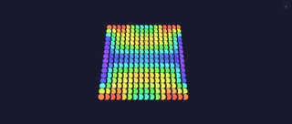

# Modifiers

Every modifier, one block each: its preview, what it does, and what each control means — together. A modifier sits between an [effect](../effects/effects.md) and the output: it reshapes *where* pixels land (or masks them) without changing the effect's drawing. Modifiers compose — a [Layer](../Layer.md) folds its whole modifier stack each rebuild; a *dynamic* modifier (one that overrides `modifyLive`) also runs a per-frame pass. See [ModifierBase](../ModifierBase.md) for the static-vs-dynamic split. Each block's emoji are its `tags()` (see the [tag emoji legend](../../../architecture.md#tag-emoji-legend)); **Kind** is static (baked into the mapping at rebuild) or dynamic (per-frame remap). Modifiers are grouped into sections, and each block carries that modifier's preview, behaviour, and control descriptions together. (For how this page maps to the source/asset folders, see the [folder-structure decision](../../../backlog/folder-structure-proposal.md).)

## MoonLight modifiers

### Block 💫 · static

Expands a 1D effect into concentric **square rings** (Chebyshev distance from the centre): the effect's linear position becomes the ring index, so a gradient effect draws nested squares.

Origin: MoonLight · via [MoonLight](https://github.com/MoonModules/MoonLight/blob/main/src/MoonLight/Nodes/Modifiers/M_MoonLight.h) · source [BlockModifier.h](../../../../src/light/modifiers/BlockModifier.h)

[Tests](../../../tests/unit-tests.md#blockmodifier)

### Checkerboard 💫 · static

Masks the layer in a checkerboard: "off" squares are dropped, "on" squares pass through unchanged.

- `size` — checker square edge in lights (≥1).
- `invert` — flip which squares pass through vs are masked.

Origin: MoonLight · by WildCats08 / [@Brandon502](https://github.com/Brandon502) · via [MoonLight](https://github.com/MoonModules/MoonLight/blob/main/src/MoonLight/Nodes/Modifiers/M_MoonLight.h) · source [CheckerboardModifier.h](../../../../src/light/modifiers/CheckerboardModifier.h)

[Tests](../../../tests/unit-tests.md#checkerboardmodifier)

### Circle 💫 · static

Expands a 1D effect into concentric **circular rings** (Euclidean distance from the centre): the effect's linear position becomes the radius, so a gradient effect draws nested circles. The circular counterpart to [Block](#block).

Origin: MoonLight · via [MoonLight](https://github.com/MoonModules/MoonLight/blob/main/src/MoonLight/Nodes/Modifiers/M_MoonLight.h) · source [CircleModifier.h](../../../../src/light/modifiers/CircleModifier.h)

[Tests](../../../tests/unit-tests.md#circlemodifier)

### Mirror 💫 · static

Folds the far half of the box back onto the near half per axis, mirroring the image across the box centre (top-left quadrant reflected into the others in 2D, near octant into all eight in 3D).

- `mirrorX` / `mirrorY` / `mirrorZ` — mirror across the centre on that axis (each default on; enabling an axis the layout doesn't use is a no-op).

Origin: MoonLight · via [MoonLight](https://github.com/MoonModules/MoonLight/blob/main/src/MoonLight/Nodes/Modifiers/M_MoonLight.h) · source [MirrorModifier.h](../../../../src/light/modifiers/MirrorModifier.h)

[Tests](../../../tests/unit-tests.md#mirrormodifier)

### Multiply 💫 · static

Tiles the logical image across the box `multiply` times per axis, optionally mirroring alternate tiles (a pure mirror is `multiply = 2, mirror = true`).

- `multiplyX` / `multiplyY` / `multiplyZ` — tile count per axis (1–64; 1 = no tiling).
- `mirrorX` / `mirrorY` / `mirrorZ` — reflect alternate tiles on that axis (with a count of 2, folds the axis in half — the kaleidoscope mirror).

Origin: MoonLight · via [MoonLight](https://github.com/MoonModules/MoonLight/blob/main/src/MoonLight/Nodes/Modifiers/M_MoonLight.h) · source [MultiplyModifier.h](../../../../src/light/modifiers/MultiplyModifier.h)

[Tests](../../../tests/unit-tests.md#multiplymodifier)

### Pinwheel 💫 · static

Remaps the grid into radial **petals** around the centre — the angle to each pixel picks its petal, with an optional swirl (angle sheared by radius), symmetry, and z-twist. Turns a linear or 2D effect into a rotating flower/spokes pattern.

- `petals` — number of petals radiating from the centre.
- `swirl` — shear the angle by radius (−127..127; a spiral; negative reverses).
- `reverse` — reverse the petal order.
- `symmetry` — fold the petals into a factor-of-360 symmetry.
- `zTwist` — twist the petals along z (3D).

Origin: MoonLight · via [MoonLight](https://github.com/MoonModules/MoonLight/blob/main/src/MoonLight/Nodes/Modifiers/M_MoonLight.h) · source [PinwheelModifier.h](../../../../src/light/modifiers/PinwheelModifier.h)

[Tests](../../../tests/unit-tests.md#pinwheelmodifier)

### RippleXZ 💫 · static

Collapses an axis to a single plane so a higher-dimensional effect ripples along the remaining axes — used to drive a 1D→2D/3D ripple.

- `shrink` — collapse the selected axis (on = collapse).
- `towardsX` / `towardsZ` — which axis collapses to a single line.

Origin: MoonLight · by @Troy (WLEDMM Art-Net) · via [MoonLight](https://github.com/MoonModules/MoonLight/blob/main/src/MoonLight/Nodes/Modifiers/M_MoonLight.h) · source [RippleXZModifier.h](../../../../src/light/modifiers/RippleXZModifier.h)

[Tests](../../../tests/unit-tests.md#ripplexzmodifier)

### Transpose 💫 · static

Swaps a pair of box axes (and every coordinate through them), then optionally inverts each axis — rotate/flip the image without redrawing the effect.

- `XY` / `XZ` / `YZ` — swap that pair of axes.
- `inverse X` / `inverse Y` / `inverse Z` — flip that axis after the swap.

Origin: MoonLight · via [MoonLight](https://github.com/MoonModules/MoonLight/blob/main/src/MoonLight/Nodes/Modifiers/M_MoonLight.h) · source [TransposeModifier.h](../../../../src/light/modifiers/TransposeModifier.h)

[Tests](../../../tests/unit-tests.md#transposemodifier)

## projectMM-native modifiers

### RandomMap · dynamic

Remaps every light to another via a true 1:1 permutation, reshuffling to a fresh permutation on a `bpm` timer — the arrangement scrambles each beat, the content is untouched.

- `bpm` — reshuffles per minute (0–60; 6 ≈ a fresh permutation every 10 s; 0 = frozen).

Origin: MoonLight · via [MoonLight](https://github.com/MoonModules/MoonLight/blob/main/src/MoonLight/Nodes/Modifiers/M_MoonLight.h) · source [RandomMapModifier.h](../../../../src/light/modifiers/RandomMapModifier.h)

[Tests](../../../tests/unit-tests.md#randommapmodifier)

### Region · static

Carves the layer to a sub-rectangle given as percentages of the physical extent (so it survives a resize); outside the region is dark.

- `startX` / `startY` / `startZ` and `endX` / `endY` / `endZ` — the sub-rectangle bounds as **percentages** of each axis's physical extent (0 = start of axis, 100 = end), so the region survives a resize; values may go negative or past 100 to push the window off-screen.

Origin: MoonLight · via [MoonLight](https://github.com/MoonModules/MoonLight/blob/main/src/MoonLight/Nodes/Modifiers/M_MoonLight.h) · source [RegionModifier.h](../../../../src/light/modifiers/RegionModifier.h)

[Tests](../../../tests/unit-tests.md#regionmodifier)

### Rotate · dynamic

Rotates the 2D image around its centre, turning continuously over time (the codebase's transform-matrix reference).

- `speed` — rotation speed (1–255; turns faster as it rises).

Origin: MoonLight · by WildCats08 / [@Brandon502](https://github.com/Brandon502) · via [MoonLight](https://github.com/MoonModules/MoonLight/blob/main/src/MoonLight/Nodes/Modifiers/M_MoonLight.h) · source [RotateModifier.h](../../../../src/light/modifiers/RotateModifier.h)

[Tests](../../../tests/unit-tests.md#rotatemodifier)

## Source

- [BlockModifier.h](../../../../src/light/modifiers/BlockModifier.h)
- [CheckerboardModifier.h](../../../../src/light/modifiers/CheckerboardModifier.h)
- [CircleModifier.h](../../../../src/light/modifiers/CircleModifier.h)
- [MirrorModifier.h](../../../../src/light/modifiers/MirrorModifier.h)
- [MultiplyModifier.h](../../../../src/light/modifiers/MultiplyModifier.h)
- [PinwheelModifier.h](../../../../src/light/modifiers/PinwheelModifier.h)
- [RandomMapModifier.h](../../../../src/light/modifiers/RandomMapModifier.h)
- [RegionModifier.h](../../../../src/light/modifiers/RegionModifier.h)
- [RippleXZModifier.h](../../../../src/light/modifiers/RippleXZModifier.h)
- [RotateModifier.h](../../../../src/light/modifiers/RotateModifier.h)
- [TransposeModifier.h](../../../../src/light/modifiers/TransposeModifier.h)
