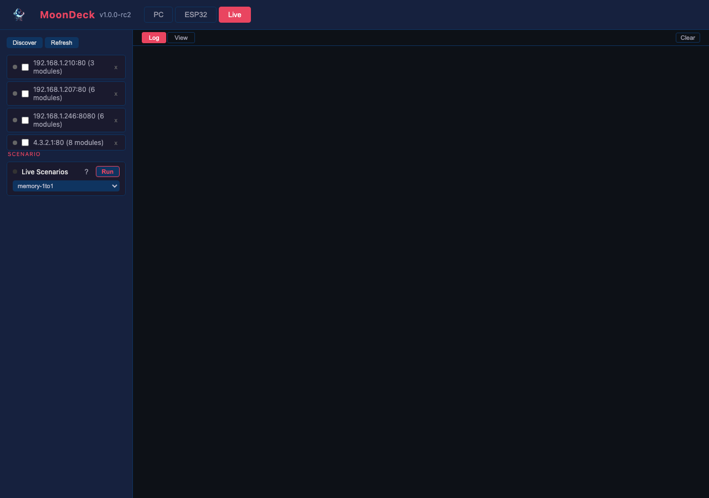

# Testing

What we test and how. The detailed inventory of every test lives in two auto-generated files:

- **[Unit tests](tests/unit-tests.md)** — one row per `TEST_CASE`, grouped by module. Generated from `test/unit/{core,light}/unit_*.cpp`.
- **[Scenario tests](tests/scenario-tests.md)** — one section per scenario JSON, grouped by module. Generated from `test/scenarios/{core,light}/scenario_*.json`. Each scenario runs in two tiers (in-process + live) unless flagged `live_only` (construct-mode scenarios are also skipped on live, since `main.cpp` owns the live shape).

Both are produced by `scripts/docs/generate_test_docs.py`; the source of truth is the test files themselves (see [Adding Tests](#adding-tests) below).

## Testing strategy

Three test categories, each with a clear purpose:

- **Unit tests** (desktop, `test/unit/{core,light}/unit_*.cpp`) — exercise individual MoonModules in isolation with doctest. Each test file declares `// @module <Name>` so it's categorised under that module in the generated inventory. Run via `ctest` or `./build/test/mm_tests`. Verify a module's API, edge cases, and output independent of how it's wired into a pipeline.
- **In-process scenarios** (desktop, `test/scenarios/{core,light}/scenario_*.json`) — exercise the system as an integrated pipeline. Each scenario is a declarative JSON file with a sequence of steps (`add_module`, `set_control`, `measure`) and optional performance bounds. The scenario runner (`test/scenario_runner.cpp`) replays the steps in-process and reports tick + heap per `measure` step. Same JSON files run against a live device through the HTTP API — that's the next tier.
- **Live scenarios** — the same scenarios driven against a running device over REST. See [Live scenarios](#live-scenarios) below.

**Picking a tier for a new test.** When the behaviour you want to pin only makes sense with modules wired together (e.g. "the pipeline reallocates cleanly when the grid resizes," "Drivers correctly hands the source buffer through after a child swap"), reach for a scenario first — that's what scenarios are *for*. When the behaviour lives inside a single module (one function's contract, one edge case, one bug regression on a small surface), a unit test is the cheaper and faster fit. Don't extend the scenario runner with new predicates just to migrate an existing unit test — that's adding abstraction without an active need. Add predicates when a *new* scenario you're writing needs them.

**Regression rule:** when a bug is found, the fix includes a new unit test or scenario that reproduces the bug. A comment in the test references the root cause so the connection stays traceable.

**Performance checks** verify architectural rules at runtime:

- **Zero-allocation render loop** — N frames, intercept `malloc` / `free`, fail if any allocation occurs during steady-state rendering.
- **Frame time bounds** — scenarios include `"bounds": {"fps": {"min_pct": N}}` (live, relative to baseline), `"bounds": {"fps": {"min": N}}` (absolute), or `"bounds": {"fps": {"min_fps_led_product": N}}` (throughput floor that scales to grid size).
- **Heap-delta bounds** — scenarios include `"bounds": {"heap": {"max_delta_bytes": N}}` on a measure step to assert this step grew the heap by no more than N bytes vs the previous measure. On desktop `freeHeap()` returns 0 (unlimited), so the assertion is effectively a no-op there; it lights up on ESP32 where heap is real.

Per-module timing, memory, and sizeof measurements per platform live in [performance.md](performance.md).

## Standards

Two principles drive every standard below:

1. **The test file is the source of truth.** Every fact about a test (which module, which scenario, what each case verifies, what each step does) lives in the test file itself. The generated docs and MoonDeck views read from there — they don't get edited by hand.
2. **One pattern, easy to spot in 30 seconds.** Every unit test follows the same header shape. Every scenario follows the same JSON shape. A new contributor recognises an existing test, then writes the next one by analogy.

### File layout

```text
test/
├── CMakeLists.txt
├── scenario_runner.cpp                       # replays scenarios in-process
├── unit/
│   ├── core/      unit_<Module>[_<topic>].cpp        # mirrors src/core/
│   └── light/     unit_<Module>[_<topic>].cpp        # mirrors src/light/
└── scenarios/
    ├── core/      scenario_<Module>_<topic>.json     # mirrors src/core/
    └── light/     scenario_<Module>_<topic>.json     # mirrors src/light/
```

A test lives under the subfolder of its **primary** `@module`'s source domain (e.g. `Layer` lives in `src/light/`, so `unit_Layer_extrude.cpp` goes in `test/unit/light/`). Cross-domain awareness travels through the `@also` list, not the directory. There's no `platform/` subfolder today — `src/platform/` is a pure abstraction layer whose desktop backend every unit test implicitly exercises; ESP32 platform code never runs on the desktop, so there's nothing to put there yet.

### Naming convention

- **Unit tests:** `unit_<ExactModuleName>[_<topic>].cpp` — `<ExactModuleName>` is the **CamelCase** class name as it appears in `// @module` (and in the source: `Layer`, `MoonModule`, `MultiplyModifier`, `NetworkSendDriver`). The optional `<topic>` collapses when the file's the only test for its module (`unit_Color.cpp` is fine if `@module Color`); add it when one module has several test files (`unit_Layer_extrude.cpp`, `unit_Layer_zero_grid.cpp`, …) or when the topic genuinely clarifies what the file covers (`unit_FilesystemModule_persistence.cpp`).
- **Scenarios:** `scenario_<ExactModuleName>_<topic>.json` — same module-naming rule; the topic is always present because scenarios always cross multiple modules and the topic distinguishes the focus.
- The **`"name"` field inside each scenario JSON** matches the filename stem exactly (e.g. `"name": "scenario_Layer_base_pipeline"`). The runner, the MoonDeck dropdown, the generated docs and `--name` on the CLI all use this single identifier.

### Unit-test file shape

Every `unit_*.cpp` file starts with **`// @module <Name>`** as its only required metadata header, then the includes, then the TEST_CASEs. Each `TEST_CASE` gets a single `//` line of end-user description on the physical line directly above it. Reading that line should tell someone what the case verifies without opening the body.

```cpp
// @module Color

#include "doctest.h"
#include "core/color.h"

// Hue 0 is pure red.
TEST_CASE("hsvToRgb red at h=0") {
    auto c = mm::hsvToRgb(0, 255, 255);
    CHECK(c.r == 255);
    ...
}

// Zero saturation produces a grey of the given value, regardless of hue.
TEST_CASE("hsvToRgb white when saturation is zero") {
    ...
}
```

Header annotations recognised by the parser:

| Tag | Required? | Shape |
|-----|-----------|-------|
| `// @module <Name>` | **yes** | Exactly one. CamelCase, must match a real module class. |
| `// @also <A>, <B>, ...` | optional | Comma-separated peer modules this test also exercises. Surfaces as “Also touches” in the generated docs and lets the MoonDeck module filter include the test for either domain. |
| `// @description <one-line>` | optional | Short file-level summary. Multiple `@description` lines concatenate. Use only when the tests don't speak for themselves — usually omit. |

Per-`TEST_CASE` description rules:

- **One physical line above the `TEST_CASE`**, no hard-wrapping; the generator and MoonDeck handle layout. A second line is allowed only when the case does something genuinely non-obvious.
- **Missing description** → the generator italicises the raw `TEST_CASE("…")` name in its place.

### Scenario modes (construct vs mutate)

Every scenario carries a top-level `mode` field that says what shape the scenario expects the world to be in. Two values:

- **`"mode": "construct"`** — the scenario builds the pipeline from an empty scheduler. Lots of `add_module` steps; the first `measure` happens after everything is wired. **Runs in-process only.** The live device's top-level shape is policy-fixed in `main.cpp` (see [src/core/HttpServerModule.cpp:639](../src/core/HttpServerModule.cpp#L639) — `/api/modules` rejects top-level adds), so "build from scratch" can't happen on a live device without re-flashing. The live runner skips construct scenarios with a clear note.
- **`"mode": "mutate"`** — the scenario assumes a wired pipeline and tweaks it (`set_control` heavy). Runs in both tiers. The in-process runner replays an embedded **`fixture`** array (same shape as `steps`, but all `add_module`) that builds the same pipeline `main.cpp` does, then runs the actual steps. The live runner skips the fixture (device is its own fixture) and pre-flights that every id the steps touch is actually present on the device — a missing id is a hard fail, not a silent skip.

Picking the right mode:
- If your scenario starts with empty Layouts/Layer/Drivers wiring, it's **construct**. It will not run live.
- If your scenario tweaks an existing pipeline (resize the grid, toggle mirror, change preset), it's **mutate**. Provide a `fixture` so in-process tests can run too.

A `mutate` scenario that needs platform-bound modules (Network mDNS, WiFi, OTA) the in-process runner can't honestly stand up should add `"live_only": true`.

**Bespoke convention.** The `mode` + `fixture` + `reset` trinity is projectMM-specific — no off-the-shelf BDD or scenario framework was borrowed wholesale. It exists because the same JSON has to serve both an in-process runner that owns the scheduler and a live runner that doesn't (main.cpp does). The closest analogs from widely-recognised testing patterns: `fixture` ≈ xUnit fixtures (setup-once, replayed per scenario); `reset` ≈ SQL `BEGIN`/`ROLLBACK` (idempotent state restoration); `mode` ≈ pytest's parametrised execution modes (one test runs in different worlds). If a future contributor finds an off-the-shelf scenario framework that captures this construct/mutate asymmetry, that's worth migrating to.

### Reset block: idempotent scenarios

`mutate` scenarios mutate shared controls (Grid size, Multiply mirror toggles, Preview detail). Without restoring those controls to known values at scenario start, measurements become coupled to *which other scenarios ran first* — last scenario's leftover state poisons this one's baseline. The fix is a top-level **`reset`** array, an `add_module`/`set_control`-shape list that runs *before* the scenario's own `steps`:

```json
"reset": [
  { "name": "reset-grid-width", "op": "set_control", "id": "Grid", "key": "width", "value": 128 },
  { "name": "reset-mirrorX", "op": "set_control", "id": "Multiply", "key": "mirrorX", "value": true }
],
```

Both runners replay reset before baseline. The baseline measurement is taken *after* reset, so it reflects the normalised pipeline state. Reset steps don't have `measure: true` — they're prep, not assertions.

Convention: reset every control your scenario writes, plus any production-default control its `steps` implicitly depend on. The cost is a few extra steps; the payoff is scenarios you can run in any order and `contract` values you can trust.

### Performance contracts (`contract[<target>]`)

Every measurable step carries a per-target `contract` block — the **performance contract** projectMM commits to delivering on that platform. The runner compares each measurement to the contract and fails if the device misses it.

```json
"contract": {
  "esp32-eth-wifi": {
    "tick_us": 90000,
    "free_heap": 105000,
    "set_by": "2026-06-02",
    "reason": "initial contract"
  },
  "pc-macos": {
    "tick_us": 300,
    "free_heap": 0,
    "set_by": "2026-06-02",
    "reason": "initial contract"
  }
}
```

**Contract semantics:**

- `tick_us` is a **ceiling** — the device must deliver this tick or faster. Going faster than contract is good news, never a failure.
- `free_heap` is a **floor** — the device must deliver at least this much free heap. Growing heap is good news.
- Both are **hand-set promises**, not auto-captured last readings. Renegotiating a contract requires `--update-contract --reason "..."` — see below.
- `set_by` records when the contract was last (re)negotiated; `reason` records why. Both stamped automatically by `--update-contract`.

Target keys match `SystemModule.firmware` on a flashed device (`esp32`, `esp32-eth`, `esp32-eth-wifi`, `esp32s3-n16r8`, …) plus `pc-macos` / `pc-linux` / `pc-windows` for desktop builds. The in-process runner picks the host OS automatically; the live runner reads the device's `firmware` control. (See [architecture.md § Firmware vs deviceModel vs board](architecture.md#firmware-vs-devicemodel-vs-board) for the distinction.)

**Tolerance** absorbs run-to-run jitter only — not "I don't care":

- Default tick tolerance: **20% on pc-*** (multi-process OS scheduling), **10% on ESP32** (lwIP / EMAC jitter).
- Default heap tolerance: same percentages.
- Default absolute floor on tick: **200 µs on pc-***, **5 µs on ESP32** — prevents percentage tolerance from going sub-noise on tiny ticks.
- **On pc-*, the floor dominates** for any contract under ~1 ms tick (effectively all PC contracts today: 5–300 µs). The percentage knob only matters for slow PC ticks. This is honest: a 100 µs PC contract realistically can't assert anything tighter than ±200 µs because multi-process scheduling jitter routinely adds 100+ µs all by itself. If you need a tight assertion, run the contract on ESP32 — bounded RTOS clocks are tighter.
- Per-step overrides: `tick_tolerance_pct`, `heap_tolerance_pct`, `tolerance_us` inside the per-target block.

**Predicted-vs-actual heap.** The runner additionally prints the sum of `dynamicBytes()` from the live module tree as `model=N`. This is what the system *says* it allocated; comparing it to `free_heap` reveals framework overhead (lwIP, WiFi, HTTP buffers). The model number is informational, not asserted.

#### Persistent observations (`observed[<target>]`)

Alongside `contract`, every measurable step keeps a **rolling [min, max] range** per scalar in the `observed.<target>` block. The range only ever *widens*: a measurement inside the current bounds doesn't change the JSON at all (no diff churn on routine runs); a measurement outside the bounds pushes the relevant end out and updates the timestamp.

```json
"observed": {
  "esp32-eth-wifi": {
    "tick_us":         [80649, 89483],
    "free_heap":       [95528, 110640],
    "max_alloc_block": [49152, 53248],
    "at":              ["2026-06-02", "2026-06-15"]
  },
  "esp32-eth": {
    "tick_us":         [99514, 99514],
    "free_heap":       [135200, 135200],
    "max_alloc_block": [49152, 49152],
    "at":              ["2026-06-02", "2026-06-02"]
  }
}
```

Read directions match the contract semantics: tick contract is a *ceiling*, so the **max** of the observed range is the value that could fail it; heap and block contracts are *floors*, so the **min** of the observed range is the failure-side. The `at` field carries `[first_seen, last_updated]` so a stale range stands out (e.g. "last_updated is six months old → re-sweep this target").

Updated by **every** successful run of `run_scenario.py` or `run_live_scenario.py` for the active target — no flag needed. A range that never widens produces no diff. When a contract is renegotiated via `--update-contract` (see below), the observed range *resets* to the new single-point measurement because the previous range belonged to the old contract.

Open any scenario JSON and the range tells you both the typical case (the value sits in the range) and the variance (range width). A wide gap between the max of the observed range and the contract ceiling means there's headroom to tighten the promise; a max creeping up against the ceiling means a regression may be imminent.

#### Renegotiating a contract

A contract changes only when there's a reason: a code change improved performance and you want to commit to the new ceiling, or an accepted regression requires loosening it. Either way the diff records *what* changed and *why*:

```bash
# After an optimisation: tighten the ceiling for pc-*
uv run scripts/scenario/run_scenario.py --update-contract \
    --reason "Layer LUT inline copy"

# After accepting an ESP32 cost: loosen the ceiling on that target
uv run scripts/scenario/run_live_scenario.py --host 192.168.1.210 \
    --update-contract --reason "added DMX driver overhead"
```

Both runners require `--reason`. They stamp `set_by` to today's date and write the new contract for the active target only — other targets are untouched. Review the diff carefully; tightening or loosening a contract is a deliberate act that ships to the project's public KPIs.

### Scenario file shape

Every `scenario_*.json` carries top-level metadata plus a `description` per step:

```json
{
  "name": "scenario_example_grid_sweep",
  "module": "GridLayout",
  "mode": "mutate",
  "also": ["Layer", "MultiplyModifier", "Drivers", "NetworkSendDriver"],
  "description": "Illustrative shape only (not a real file). Walk the grid through 16x16 → 32x32 → 64x64 → 128x128 and assert a per-size FPS floor.",
  "fixture": [
    { "name": "fix-layouts", "op": "add_module", "id": "Layouts", "type": "Layouts" },
    { "name": "fix-grid", "op": "add_module", "id": "Grid", "type": "GridLayout", "parent_id": "Layouts", "props": {"width": 16, "height": 16} },
    { "name": "fix-layer", "op": "add_module", "id": "Layer", "type": "Layer", "props": {"layouts": "Layouts", "channelsPerLight": 3} },
    { "name": "fix-noise", "op": "add_module", "id": "Noise", "type": "NoiseEffect", "parent_id": "Layer" },
    { "name": "fix-mirror", "op": "add_module", "id": "Multiply", "type": "MultiplyModifier", "parent_id": "Layer" },
    { "name": "fix-drivers", "op": "add_module", "id": "Drivers", "type": "Drivers", "props": {"layer": "Layer"} },
    { "name": "fix-artnet", "op": "add_module", "id": "ArtNet", "type": "NetworkSendDriver", "parent_id": "Drivers" }
  ],
  "reset": [
    { "name": "reset-grid-width", "op": "set_control", "id": "Grid", "key": "width", "value": 128 },
    { "name": "reset-grid-height", "op": "set_control", "id": "Grid", "key": "height", "value": 128 },
    { "name": "reset-mirrorX", "op": "set_control", "id": "Multiply", "key": "mirrorX", "value": true },
    { "name": "reset-mirrorY", "op": "set_control", "id": "Multiply", "key": "mirrorY", "value": true }
  ],
  "steps": [
    {
      "name": "size-128x128",
      "description": "Set grid to 128x128. Production-size target.",
      "op": "set_control", "id": "Grid", "key": "width", "value": 128,
      "measure": true,
      "bounds": { "fps": { "min_pct": 70 } },
      "contract": {
        "esp32-eth-wifi": {
          "tick_us": 100000, "free_heap": 105000,
          "set_by": "2026-06-02", "reason": "initial contract"
        },
        "pc-macos": {
          "tick_us": 120, "free_heap": 0,
          "set_by": "2026-06-02", "reason": "initial contract"
        }
      }
    }
  ]
}
```

`name` matches the filename stem exactly; `module` drives the doc grouping and the MoonDeck filter; `also` lists peer modules. `mode` is `construct` or `mutate` (see above). `fixture` is required for `mutate` scenarios that need to run in-process. `reset` (optional but recommended for mutate scenarios) normalises controls before measurement so contract assertions aren't coupled to run order. `contract[<target>]` carries the per-target performance contract — see § Performance contracts. `observed[<target>]` carries a rolling `[min, max]` range per metric (tick_us, free_heap, max_alloc_block) plus `at: [first_seen_iso, last_seen_iso]` timestamps — widen-only across runs, so each run extends the range rather than replacing it; see § Persistent observations. Per-step `description` is recommended (a missing one falls back to the step's `name`/`op` in the generated view). Optional top-level `"live_only": true` keeps the scenario out of the in-process runner. Optional per-step `"measure": true` triggers a measurement after the step with optional `bounds`:

- `bounds.fps.min` — absolute FPS floor (in-process).
- `bounds.fps.min_pct` — relative to baseline (live runner).
- `bounds.fps.min_fps_led_product` — throughput floor scaling to grid size.
- `bounds.heap.max_delta_bytes` — max heap growth vs the previous measure step (lights up on ESP32; no-op on desktop).

**`bounds` and `contract` co-exist by design** — they catch different things on the same measure step:

- `bounds` are **relative within a single run**: "this step's FPS must be at least 80% of *this run's* baseline." Catches a measurement collapsing mid-scenario (effect silently dropping frames, mirror toggle leaving a degraded state). Cheap because it doesn't depend on history.
- `contract.<target>` is an **absolute promise across runs**: "this step must hit ≤ X µs / ≥ Y bytes heap on this platform." Catches regressions over time that bounds can't see (the baseline itself drifts).

If you only need one, prefer `contract` — it's the load-bearing assertion. `bounds` is the within-run sanity check.

Unknown JSON keys are ignored by both runners (C++ and Python), so adding a new field is safe.

### Generated docs and the shared parser

```text
scripts/docs/
├── _test_metadata.py        # one parser used by both consumers below
└── generate_test_docs.py    # writes docs/tests/unit-tests.md + scenario-tests.md
scripts/moondeck.py          # serves the same data as HTML in MoonDeck views
```

Both the markdown generator and the MoonDeck endpoints (`/api/test-modules`, `/api/unit-tests/<Module>`, `/api/scenarios/<name>`) import from `_test_metadata.py`. Adding a new metadata field (e.g. `@since`) means one edit there; both consumers pick it up.

Run the generator after touching any test file:

```bash
uv run scripts/docs/generate_test_docs.py            # writes both docs
uv run scripts/docs/generate_test_docs.py --check    # exits non-zero on drift (CI-friendly)
```

`--check` exits non-zero when the docs are stale — a contributor who adds a `TEST_CASE` without re-running the generator gets flagged. Run it in CI or before a commit to keep the generated docs in sync.

## Unit tests

Inventory: **[docs/tests/unit-tests.md](tests/unit-tests.md)** (auto-generated, grouped by `@module`).

Run them with:

```bash
# Replace build/macos with build/linux or build/windows per host. The
# MoonDeck path below and `uv run scripts/test/test_desktop.py` resolve the
# host build dir automatically; the raw ctest / mm_tests calls don't.
ctest --test-dir build/macos --output-on-failure   # all
./build/macos/test/mm_tests -tc="<case-name>"      # one test case
uv run scripts/test/test_desktop.py --module Layer # filtered by module
```

Or via MoonDeck (PC tab → Unit Test card). Pick a module from the shared module dropdown above the card to filter the run. Tests button shows the per-module inventory.

Output is summary-only on a full run (the doctest `-s` flag is added only on filtered runs, where the assertion-level detail is small enough to be useful).

## In-process scenarios

Inventory: **[docs/tests/scenario-tests.md](tests/scenario-tests.md)** (auto-generated, grouped by `module`).

Run them with:

```bash
uv run scripts/scenario/run_scenario.py                                      # all
uv run scripts/scenario/run_scenario.py --name scenario_Layer_base_pipeline  # one by stem
uv run scripts/scenario/run_scenario.py --module Layer                       # all for one module
```

Or via MoonDeck (PC tab → Scenarios card). The module dropdown is shared with the Unit Test card above it: pick a module once and both card's run-set narrows. Steps button shows the per-scenario step list.

**Scenarios with `"live_only": true`** are skipped in-process (they need a real device — e.g. measure real-Ethernet throughput at a given grid size). They appear in the inventory but only run via the live tier below. The symmetric case (scenarios that only make sense in-process) is already handled by `mode: "construct"`, which skips on live.

**Step ops** the in-process runner understands today:

- `add_module` — instantiate a module by `type`, register it under `id`. Top-level when no `parent_id`. Mid-scenario adds (after the first `measure` step) run setup() + buildState() immediately, mirroring the live `/api/modules` POST shape.
- `remove_module` / `delete_module` — delete a child module from its parent (teardown + recursive free + buildState). The two names are aliases (the in-process and live runners must never diverge on op names, or a scenario silently no-ops on one tier). Refuses non-editable submodules (`userEditable()==false`) and top-level modules.
- `replace_module` — swap a child for a fresh module of another `type` at the same slot. A default-named module relabels to the new type; a custom/scenario id is preserved so later steps can still address it. Mirrors `/api/modules/<name>/replace`.
- `clear_children` — delete every deletable child of a container (`id`), leaving the container. The "prepare my own canvas" primitive: a scenario assumes nothing about the device's starting tree, clears a container, then adds what it needs. Non-editable children (Board, Preview, Improv) are skipped.
- `set_control` — write a control on an already-added module (`id` + `key` + `value`). Mirrors `handleSetControl`: applies the typed write, calls `onUpdate()`, and triggers `Scheduler::buildState()` if `controlChangeTriggersBuildState` returns true. Today supports Uint8 / Uint16 / Int16 / Bool / Text / Password / Select. A step may carry `"optional": true` — a best-effort write (e.g. shrink a grid that may not exist) that's skipped, not failed, when the target is absent.
- `measure` — pure measurement step. Runs warmup + measure frames, prints per-step tick / FPS / lights / heap-delta, applies any `bounds` assertions for this step.

A step can also set `"measure": true` on a non-measure op (e.g. mark the last `add_module` as the one to measure after); the runner treats either shape identically.

## Live scenarios

Live scenarios run the same JSON against a running device via the REST API.

```bash
uv run scripts/scenario/run_live_scenario.py --host localhost:8080       # desktop
uv run scripts/scenario/run_live_scenario.py --host 192.168.1.210        # ESP32
uv run scripts/scenario/run_live_scenario.py --update-baseline           # save
uv run scripts/scenario/run_live_scenario.py --compare-baseline          # check
```

MoonDeck's Live tab wraps the same workflow: the Network bar at the top selects the LAN, Discover/Refresh populates the device list, the Live Scenarios card runs the selected scenario against every checked device.



All scenarios use relative FPS bounds (`min_pct`) so they pass on any device — desktop at 10K FPS or ESP32 at 17 FPS. Settle time is 3 seconds to let the pipeline stabilise after rebuilds.

Scenarios that add modules (e.g. `scenario_Layer_base_pipeline`, `scenario_Layer_memory_1to1`) create temporary modules on the running device and clean them up at the end (`- Rainbow (cleanup)`). Modules that already exist show `=` instead of `+`.

Memory tracking works on ESP32: `freeHeap` and `freeInternalHeap` report real values. Desktop returns 0 (unlimited). The control-change scenario verifies no memory leaks by checking that heap returns to baseline after a mirror toggle.

One live-tier test lives outside the scenario JSON schema because it spans **multiple devices**: `uv run scripts/scenario/run_network_live.py` runs a lights-over-UDP matrix (ArtNet, E1.31 and DDP) over every online board in moondeck.json — each board is once the sender, all others listen, and reception is asserted by reading each device's `/ws` preview stream (see [MoonDeck.md § run_network_live](../scripts/MoonDeck.md#run_network_live)). A device matrix needs loops and per-round state the declarative scenario JSON can't express, so it follows the `improv_smoke_test.py` script shape instead.

## Hardware Verification

All live scenarios pass on both desktop and ESP32 with `min_pct: 80` relative bounds. Per-module timing, memory allocation, and sizeof measurements for each platform are in [performance.md](performance.md).

### ESP32 — Olimex ESP32-Gateway Rev G (no PSRAM)

- 128×128 grid (16,384 lights) — all live scenarios pass.
- Memory tracking verified: mirror toggle shows heap changes, returns to baseline (no leaks).
- Ethernet (LAN8720 RMII) connects via DHCP.
- Device discovery from MoonDeck finds the ESP32 on port 80.

## Adding Tests

**Unit test:** add a `TEST_CASE` to the appropriate `test/unit/{core,light}/unit_<ExactModuleName>[_<topic>].cpp` file. Each file carries `// @module <ExactCamelCaseName>` at the top, plus a single `//` description line above each `TEST_CASE`. Add a new file when no existing test covers your module — pick the subfolder matching the module's `src/` domain. After adding cases, run `uv run scripts/docs/generate_test_docs.py` so the generated inventory matches.

**Scenario test:** create a JSON file under `test/scenarios/{core,light}/` named `scenario_<ExactModuleName>_<topic>.json`. The top-level needs `name` (matching the filename stem), `module`, optional `also`, `description`, `mode` (`construct` or `mutate`), and optional `"live_only": true` if the scenario can only run against a real device. Each `steps[]` entry has an `op` (`add_module`, `set_control`, `measure`), a `name`, a `description` field that the doc generator picks up, optional `"measure": true` to run a measurement after the op, and optional `bounds` (`fps` and/or `heap`). The scenario runner auto-discovers all `.json` files under `test/scenarios/` recursively.

**Regression test:** when fixing a bug, add a test that reproduces it. The test's description (the `//` line for unit tests, the `description` JSON field for scenarios) should mention the root cause so the connection stays traceable in the generated inventory.

**Doc check:** `scripts/docs/generate_test_docs.py --check` exits non-zero if regeneration would change `docs/tests/*.md` — a CI-friendly way to catch metadata that drifted from the source.
