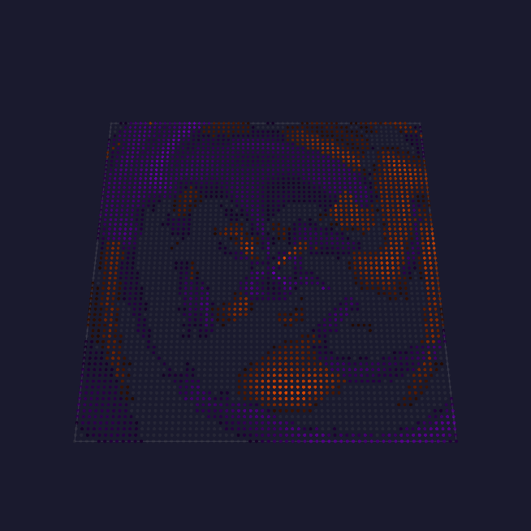
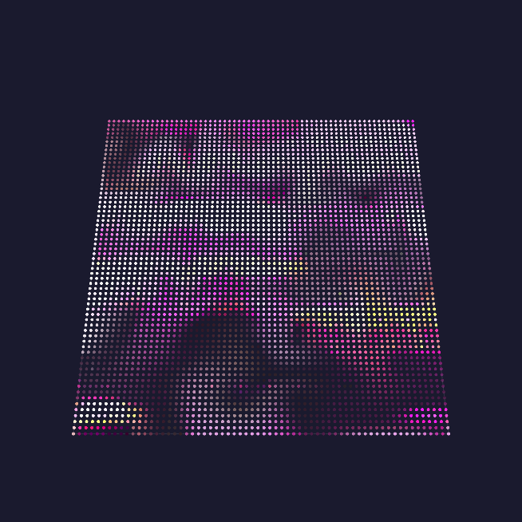
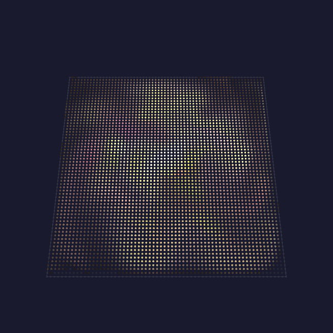

# Making beautiful effects

Most LED effects are written a light at a time: loop over the pixels, work out a
color, write it. That works, and it takes a long time to get from "it lights up"
to "I want to keep watching it".

This page is about the other way. projectMM ships a set of **power functions**:
the handful of algorithms that computer graphics has used for forty years to make
things look alive. You do not implement them, you compose them. And because every
one of them is available to **MoonLive** scripts as well as to compiled C++, a
few dozen lines of script gets you an effect that would otherwise be a project.

> Never opened the interface? Start with **[Install & first light](../gettingstarted.md)**
> and **[How projectMM works](how-projectmm-works.md)**, then come back.

---

## 1. The one idea: a field

Here is the shift that makes everything else easy.

Instead of asking *"what should pixel 37 be?"*, ask *"what is the value of this
field at (x, y, z), right now?"* The field is a function of position and time. You
sample it once per light, turn the number into a color, and the picture falls out.

That is what a **shader** is, and it is why an effect written this way is
resolution-independent: the same code fills a 16-light strip and a 12,288-light
wall, because it never counted pixels in the first place.

Fields also compose. Add two, and you get a third. Use one to bend another's
coordinates, and you get something neither could produce alone. That is the whole
trick, and the rest of this page is the vocabulary.

---

## 2. Noise: the raw material

Random numbers look like static. **Noise** looks like nature, because a noise
value is close to its neighbors: it wanders instead of jumping.

**Ken Perlin** published it in 1985 (*An Image Synthesizer*), after developing it
on the movie *Tron*; it later won him an Academy Award. projectMM uses his own
revision, *improved noise* (SIGGRAPH 2002), which removes the directional bias of
the original.

```
int v = noise(x * 20, y * 20, div(t, 32));   // 0..255, smooth in every direction
```

Three things to know, and then you can use it:

**Scale is everything.** `noise(x, y, 0)` reads one value per light and looks like
static, because adjacent lights land in completely different parts of the field.
Multiply the coordinate down and you zoom in: `noise(x * 20, y * 20, 0)` gives
broad soft blobs. Getting this wrong is the single most common reason a noise
effect looks like colored snow.

**Time is just another axis.** Do not recompute a 2D field and shift it. Sample a
3D field and walk along z: `noise(x * 20, y * 20, div(t, 32))`. The picture morphs
instead of scrolling, which is what makes it look organic rather than mechanical.

**1D, 2D and 3D are the same call.** One axis for a strip, two for a panel, three
for a cube, or two of space and one of time. `noise()` takes what you give it.

(`div(t, 32)` rather than `t / 32`: MoonLive spells integer division `div`, and
`t` is the millisecond clock every script is handed.)

---

## 3. Octaves: detail at every size

One noise sample is a soft blur. Nature is not soft: a coastline has bays, and the
bays have inlets, and the inlets have rocks.

**fBm** (fractional Brownian motion, the term is Mandelbrot's) is the answer, and
it is embarrassingly simple. Sample the field several times, each at double the
frequency and half the strength, and add them up. Each pass is an **octave**, the
name borrowed from music, where an octave is also a doubling.

```
int v = fbm(x * 20, y * 20, 2);   // 2 octaves: shape, plus texture on it
```

| Octaves | What you get | What it costs |
|---|---|---|
| 1 | soft blobs | 1 sample |
| 2 | shape with texture on it | 2 samples |
| 4 | rock, cloud, terrain | 4 samples |

Octaves are the **cost knob** of every field effect: doubling them doubles the
work per light. Two is usually the sweet spot; four is for when the fixture is
small enough to afford it.

One measured detail worth knowing: octaves partly cancel, so their sum is
narrower than one octave's range. Four octaves span roughly 54..199 of 0..255
rather than the full sweep. projectMM re-widens the result for you, so `fbm` at
any octave count still uses the whole range and your thresholds keep working.

---

## 4. Warp: the trick that sells it

This one is worth learning on its own, because it is the difference between "some
noise" and "that looks like smoke".

**Domain warping** (popularized by **Inigo Quilez**, of Shadertoy) means using
noise to move the place where you sample noise. You are not adding a field to a
field, you are bending one field's coordinates with another.

```
int v = warp(x * 20, y * 20, 60);   // 60 = how far the field displaces itself
```

The result flows, folds and curls back on itself. Almost every "liquid" or
"marbled" look you have admired is domain warping.



That is **Aurora**: a few layers of warped noise, each drifting on its own clock,
read around the center instead of across the grid, with a contrast window that
pushes most of the field to black so distinct curtains survive.

---

## 5. From lines to fields: the ladder

The power functions are a ladder, and the rungs are worth knowing because each one
buys a different kind of beauty.

**Lines and shapes** are the bottom rung. `line` (Bresenham 1962), `circle`
(Bresenham's 1965 midpoint form), `disc`, `sphere`, `text`, `sprite`. Exact,
cheap, and the right answer when you want a *thing* on the panel rather than a
texture.

**Signed distance fields** are the same shapes, made soft. Instead of "is this
pixel inside the circle", `sdCircle` answers "how far is this pixel from the
edge", negative inside. A distance is a number you can threshold, glow, outline or
blend, and two distance fields blend into shapes neither one describes. The
catalog follows **Inigo Quilez**'s.

**Particles** give you motion with memory. A particle pool carries position and
velocity, and `gravity`, `drag`, `bounce` and `collide` act on all of them at
once. Use this when the thing that matters is that a spark *fell*, and the pixels
are just where it happens to be.

**Fields** are where this page started: noise, fBm, warp, sampled per light.

**Transport** is the top rung, and it is what this release added. A field says
where things go; transport actually *carries* light along it, frame after frame.
`advect` moves a whole plane along a velocity field by asking, for each
destination, where its contents came from. `decay` fades what is already there by
a half-life in milliseconds. Together they make a trail that is not drawn: it is
the previous frames' light, moved and dimmed.

**Curl noise** (**Robert Bridson**, 2007) is the field transport wants. Take a
noise field and use its perpendicular gradient, and the result is
*divergence-free*: it swirls, but nothing ever piles up or drains away. That
property is why a curl flow reads as a real medium rather than as arrows.



**Simulation** is the last rung. **Jos Stam**'s *Stable Fluids* (SIGGRAPH 1999)
solves the medium's own motion: diffuse, project, advect, project. Every other
flow is a function of position and time; this one is state. A jet fired now
changes where everything downstream goes for seconds afterwards.



---

## 6. Why 16 bits, in one paragraph

A trail is a value multiplied by slightly less than one, sixty times a second. At
8 bits that does not work: a value of 100 multiplied by 0.994 either truncates
back to 99 and keeps falling too fast, or rounds back to 100 and never fades at
all. The tail either vanishes or freezes.

So every effect that carries light over time keeps its own plane at **16 bits**
and narrows to 8 once, at the end, with dithering. The layer buffer stays 8-bit,
which keeps every driver fast. You get this for free: `trail(1)` in a script
allocates it, and the blit happens for you.

---

## 7. Compiled or scripted

Most of the vocabulary above exists twice: as a C++ kernel, and as a MoonLive builtin. Same
algorithm, same numbers. Not all of it, though: `line`, `circle`, the noise family and the whole
transport set are scriptable, while `disc`, `sphere`, `text`, `sprite`, the SDF catalog and the
fluid solver are compiled-only for now.

**MoonLive** is projectMM's scripting language. Scripts are compiled to native
code on the device, so a script is not interpreted per pixel: it runs at machine
speed. You edit one in the browser and the picture changes as you type.

The interesting number is how little a script has to say:

| Effect | MoonLive script | Compiled C++ |
|---|---:|---:|
| Fluid | 44 lines | 276 lines |
| Trails | 50 lines | 261 lines |
| Aurora | 58 lines | 216 lines |
| Nebula | 63 lines | 271 lines |

These are not stripped-down versions: each is a real effect someone would happily
run. The reason they are a fifth of the size is that **the heavy lifting is in the
kernels, and the kernels are available to both.** A script does not implement
advection; it calls it. The C++ version is longer mostly because it also handles
allocation, resizing and control registration, which the script binding does on the
script's behalf.

One honest caveat on that table: `fluid.mle` is not the Stam solver. The solver has no script
binding yet, so the script pours jets into a curl flow, which LOOKS like a fluid without simulating
one. Aurora, Trails and Nebula are genuinely the same effect in both columns.

This is the point where the two halves reinforce each other. Every kernel added
for a compiled effect immediately makes scripts more capable, and every effect
that turns out to be expressible as a script is one that does not need to be
compiled in at all. `fluid.mle` is 44 lines:

```
void tick() {
  flowCurl(zoom, div(force * 4 * span, 64));       // the medium
  trailDecay(40 + persistence * persistence / 12); // the fade

  for (int i = 0; i < jets; i = i + 1) {
    int a = osc(rate, t, 2) + i * 10922;           // where this jet points
    ...
    emitTrail(jx, jy, z, color, 255, radius);      // pour dye in
  }
}
```

Three kernel calls and a loop. That is a fluid-looking effect.

**Which to use.** Script first, always: you can iterate in seconds and you cannot
crash the device. Move to C++ when you need something the vocabulary does not
have, or when you are writing a per-light loop on a very large fixture and the
script boundary starts to cost (a script call per light is thousands of crossings
per frame; `fieldRate(n)` exists precisely to make that affordable).

---

## 8. Everything is 3D, when the fixture is

Every kernel on this page takes a depth. On a panel you pass 1 and pay nothing:
the loop is the 2D loop exactly. On a cube, the field is sampled along a real
third axis, so the slices differ instead of one plane repeating.

Worth knowing where the line currently is: the **fields** are genuinely
volumetric, while **transport** carries light within each slice and not yet
between them. A trail on a cube travels across its slice, not through the volume.

---

## 9. Try this

The fastest way to feel it is to break something on purpose. Open a MoonLive
script, pick one number, and move it a long way.

| Change | What you should see | The lesson |
|---|---|---|
| `zoom` very low, then very high | soft blobs, then colored static | scale is everything |
| octaves 1 to 4 | texture appears on the shape, frame time rises | octaves are the cost knob |
| `warp` from 0 upward | the field stops drifting and starts folding | domain warping |
| `persistence` low to high | tails from a flicker to seconds long | half-life decay |
| Fluid's `iterations` to 1 (the compiled effect, not the script) | the flow reads springy | the pressure solve is what makes it a fluid |

## Where to go next

- **[Power functions](../moonmodules/light/power-functions.md)**: the catalog, with what each one costs and who calls it
- **[Writing scripts](../moonmodules/light/writing-scripts.md)**: the MoonLive language reference
- **[Effects](../moonmodules/light/effects.md)**: every effect in the tree, with its controls
