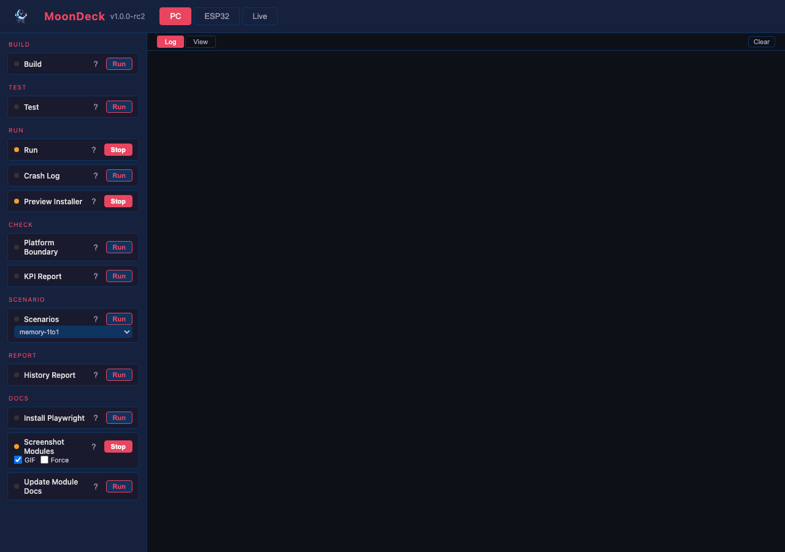
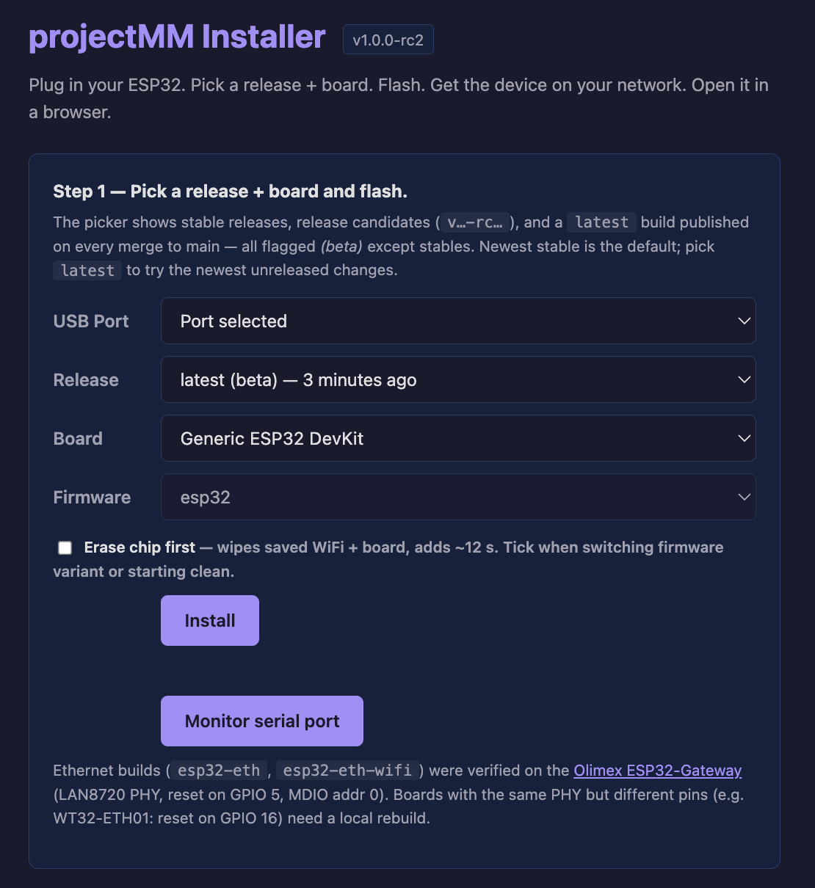
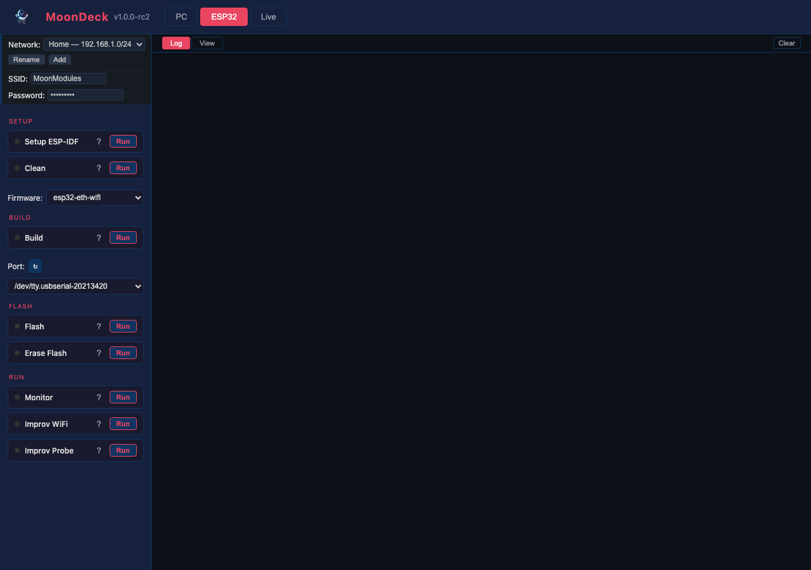

# MoonDeck Script Reference

## UI Features

- **Status dots** on each card: grey (not run), orange (running), green (exit 0), red (exit non-zero).
- **Run/Stop toggle** for long-running scripts (Run desktop, Monitor ESP32).
- **Group headers** in the sidebar (setup, build, flash, run, test, check, scenario).
- **Destructive-action confirm** — scripts flagged `destructive: true` (e.g. Erase Flash) pop a native confirm dialog before running.
- **Tab persistence** — selected tab survives page refresh.
- **Process detection** — on page load, checks if projectMM or idf.py is already running and shows Stop button.
- **Network bar** (top of the sidebar): switch between known networks. Each network holds its own device list, last-used serial port, and WiFi credentials (consumed by Improv). On startup, MoonDeck auto-selects the network whose subnet matches the host's current LAN — moving the laptop between networks usually requires no clicks. Manual override (the dropdown) pins the selection until the pinned network's subnet stops matching the host. Add / Rename buttons next to the dropdown manage the catalog. State persisted in `scripts/moondeck.json` under `networks` + `active_network`.
- **Board picker** on each device row: dropdown of physical boards from [docs/install/boards.json](../docs/install/boards.json) — the same catalog the web installer will use. When the device's firmware uniquely identifies one board (e.g. `esp32-eth-wifi` → Olimex Gateway), MoonDeck auto-deduces and mirrors the value to the device's [BoardModule](../docs/moonmodules/core/BoardModule.md) via `POST /api/control` on next discover. For firmwares with no unique board (`esp32` runs on multiple), the user picks; MoonDeck pushes that value too. A device-reported board not in the catalog still shows up as `<key> (unknown)` so the value survives.

## PC Tab




### build_desktop

Build the desktop target using CMake.

```bash
uv run scripts/build/build_desktop.py
```

Runs `cmake -B build/<host> -DCMAKE_BUILD_TYPE=Release` then `cmake --build build/<host>`, where `<host>` is `macos`, `linux`, or `windows` depending on the OS this script runs on. The per-host directory keeps an experimental Linux build from clobbering a macOS one on the same machine, and mirrors the ESP32 side's `build/esp32-<board>/` shape.

### test_desktop

Run the desktop test suite.

```bash
uv run scripts/test/test_desktop.py
```

Runs `./build/test/mm_tests -s` (doctest with all test cases shown).

### run_desktop

Launch the desktop executable as a detached background process and exit. The app keeps running across other MoonDeck scripts and outlives MoonDeck itself — the same model as flashing an ESP32, where the device runs independently of this console.

```bash
uv run scripts/run/run_desktop.py
```

Re-running is idempotent: any existing `projectMM` instance is stopped first, then a fresh one is launched. Output goes to `build/<host>/projectMM.log`. Build first.

While the app is running, MoonDeck shows the button as **Stop** (a 5-second poll on `/api/running` detects the live process via `process_name`). Pressing Stop terminates the app; pressing Run again restarts it. From the CLI: `pkill -f build/<host>/projectMM` (or `pkill projectMM` if you don't have multiple host builds active).

### preview_installer



Locally preview the web installer page at <https://ewowi.github.io/projectMM/install/> without tagging a release. Stages `docs/install/index.html` + `src/ui/release-picker.js` into `build/install-preview/` and serves them via Python's `http.server` on port 8000.

```bash
uv run scripts/run/preview_installer.py
# open http://localhost:8000/ in Chrome / Edge / Opera
```

Long-running — MoonDeck shows **Stop** while the server is up. Two modes, picked automatically:

- **Render-only.** When no `build/esp32-*/projectMM.bin` is present, the picker populates against the real GitHub Releases API and dropdowns work, but clicking **Install** fails because the local server has no `releases/` tree. Useful for iterating on HTML / CSS / JS without burning a build. Equivalent to "Recipe A" in [docs/install/README.md](../docs/install/README.md).
- **Flash-ready.** When at least one ESP32 build exists, the script additionally stages every `build/esp32-*/projectMM.bin` it finds into `releases/local-dev/` and generates matching Pages-relative manifests via the same `generate_manifest.py` the release workflow uses. The picker shows `local-dev` as the newest tag; clicking **Install** flashes a USB-connected ESP32 and opens the ESP Web Tools Improv WiFi modal — end-to-end, same code paths as the public installer. This is the developer's test ground for the install flow before deploying to GitHub Pages: Web Serial works on `http://localhost` without the secure-origin requirement that gates the public site.

Add `?nocache=1` to the URL to bypass the picker's 5-minute sessionStorage cache while editing.

### check_platform_boundary

Verify that platform-specific code stays inside `src/platform/`.

```bash
uv run scripts/check/check_platform_boundary.py
```

Scans all source files outside `src/platform/` for forbidden includes and platform `#ifdef`s.

### scenario_pipeline

Run scenario tests. Replays JSON scenario files in-process.

```bash
uv run scripts/scenario/run_scenario.py                       # run all
uv run scripts/scenario/run_scenario.py --name scenario_Layer_base_pipeline   # run one
```

Scenarios are JSON files in `test/scenarios/`. Use the dropdown to run a single scenario or leave it on **all** to run the full suite.

For a full description of each scenario, see the [scenario inventory](/api/docs/tests/scenario-tests.md) — auto-generated from the JSON files.

### history_report

Generate a human-readable history report from `git log` + `gh release list`. Writes a single markdown file at `build/history.md` (gitignored — the report is an artifact, not source; storing it in the repo would duplicate what git already carries).

```bash
uv run scripts/report/history_report.py              # default: build/history.md
uv run scripts/report/history_report.py --out /tmp/h.md
```

Output shape:

- **Releases** table: the most-recent 10 tagged releases with tag, date, and channel (stable / rc / latest).
- **History** section: combined graph + commits, newest first. Each commit row shows its graph-rail (`*`, `| *`, `*   `, …) as a monospace prefix to the SHA + date + subject. Merge commits get a ⤴ badge. The full body lives in a left-bordered blockquote underneath, visually extending the rail's vertical line into the description. Branch connector rows (`|\`, `|/`, `| |`) render as standalone monospace lines between commits. Inside each body, `- foo` lines render as nested bullet lists. Each SHA links to the corresponding GitHub commit page when an origin remote is configured.
- **Summary** footer: commit count, release count, generation timestamp.

The MoonDeck button writes the file, prints a `MOONDECK_VIEW: /api/history-report` marker that the log renderer auto-opens in the View pane (and renders as an "Open in View pane → …" clickable link). Re-runs on identical git state produce a deterministic file except for the timestamp line in the footer.

### screenshot_modules

Capture UI screenshots of every module that has controls and save them to `docs/assets/screenshots/`.

```bash
uv run scripts/docs/install_playwright.py    # one-time (or use Install Playwright button in MoonDeck)
uv run scripts/docs/screenshot_modules.py    # requires projectMM running on localhost:8080
uv run scripts/docs/screenshot_modules.py --host 192.168.1.210:8080
uv run scripts/docs/screenshot_modules.py --gif    # also record 3-second GIF previews
uv run scripts/docs/screenshot_modules.py --force  # re-capture and overwrite existing screenshots
```

The **GIF** and **Force** checkboxes in MoonDeck toggle these flags.

Connects to a running projectMM server, builds a minimal pipeline scaffold (Layouts → Grid, Layer, Drivers), adds each module, screenshots its card, then removes it. Saves:

- `<TypeName>.png` — module card screenshot for every module in the catalogue
- `<TypeName>.gif` — 3-second preview animation for effects and modifiers (requires `--gif`)
- `ui_overview.png` — full-page screenshot of the projectMM UI
- `moondeck_pc.png`, `moondeck_esp32.png`, `moondeck_live.png` — MoonDeck tab screenshots (requires MoonDeck running on port 8420)
- `installer.png` — web installer preview (requires `preview_installer` running on port 8000)

Without `--force`, existing screenshots are skipped — only missing files are captured. Run with `--force` to re-capture everything (e.g. after a UI change).

GIF capture uses ffmpeg (install with `brew install ffmpeg`). Each GIF is assembled from frames captured via Playwright — the WebGL canvas is read via `page.screenshot(clip=...)` rather than `canvas.toDataURL()` to work correctly in headless mode.

After capture, run `update_module_docs` to insert the references into the module spec files.

### update_module_docs

Insert screenshot and GIF references into `docs/moonmodules/**/*.md` files.

```bash
uv run scripts/docs/update_module_docs.py            # update all
uv run scripts/docs/update_module_docs.py --dry-run  # preview without writing
```

For each `.md` file, if `docs/assets/screenshots/<TypeName>.png` exists and the file doesn't already contain a screenshot reference, inserts the image after the first heading. If a matching `<TypeName>.gif` also exists, inserts the GIF reference on the next line. Safe to re-run — skips files that already have all references.

Also inserts MoonDeck tab screenshots and the installer screenshot into `scripts/MoonDeck.md` and `README.md` at fixed anchor points (defined in the `EXTRA_SHOTS` list in the script).

Reports unreferenced screenshots — any PNG or GIF in `docs/assets/screenshots/` not mentioned anywhere in `docs/` or `scripts/`.

## Live Tab


### live_scenario

Run scenario tests against a live running device via HTTP.

```bash
uv run scripts/scenario/run_live_scenario.py                                    # all scenarios vs localhost:8080
uv run scripts/scenario/run_live_scenario.py --host 192.168.1.210               # vs ESP32
uv run scripts/scenario/run_live_scenario.py --name scenario_MoonModule_control_change   # one scenario
uv run scripts/scenario/run_live_scenario.py --update-baseline                  # save baseline
uv run scripts/scenario/run_live_scenario.py --compare-baseline                 # detect regressions
```

Executes scenario steps (add_module, set_control, delete_module) via REST API. Collects per-step FPS and heap measurements. Compares against stored baselines to detect performance regressions. Use the dropdown to run a single scenario or leave it on **all** to run the full suite.

For a full description of each scenario, see the [scenario inventory](/api/docs/tests/scenario-tests.md) — auto-generated from the JSON files.

## ESP32 Tab




The tab is laid out top-to-bottom along the firmware workflow. Each dropdown sits between the script groups that consume it, so picking a dropdown is the natural prelude to the buttons below it.

```text
[Setup ESP-IDF] [Clean]            ← board-independent
Firmware: [esp32 / esp32-eth / esp32-eth-wifi / esp32s3-n16r8]
[Build]                            ← uses the selected Firmware
Port:     [/dev/tty.usbserial-XXXX] [↻]
[Flash] [Erase Flash]              ← uses the selected Port
[Monitor] [Improv WiFi] [Improv Probe]
```

The Firmware dropdown drives **Build** and **Flash**. Each board has its own build dir at `build/esp32-<board>/`, so multiple firmwares coexist on disk — switching the dropdown is free, no rebuild penalty. Flash reads the dir matching the dropdown; if you haven't Built that board yet, Flash exits with a clear "no build for <board>" message. The Port dropdown drives every script in the Flash and Run groups; the **↻** refresh next to it re-scans USB-serial devices without a page reload. Erase Flash uses the Port but doesn't care about Firmware (it wipes everything).

### setup_esp_idf

Set up ESP-IDF Python environment.

```bash
uv run scripts/build/setup_esp_idf.py
```

Finds the ESP-IDF installation and runs `install.sh` to create the Python venv. Run once after installing ESP-IDF or after a Python version change.

### clean_esp32

Clean the ESP32 build directory.

```bash
uv run scripts/build/clean_esp32.py
```

Removes one ESP32 per-firmware build dir (`--firmware <name>`) or every `build/esp32-*/` plus a leftover `esp32/build/` if present (`--all`). Run a per-firmware clean after ESP-IDF updates, Python version changes, or anything else that should force a from-scratch build of that variant. Other firmwares' build dirs aren't touched.

### build_esp32

Build one of the four shipping ESP32 firmware variants. The MoonDeck **Build** button reads the **Firmware** dropdown and forwards `--firmware <selected>` to `build_esp32.py`. ("Firmware" is the compiled binary; the physical board is a separate concept — see [architecture.md § Firmware vs board](../docs/architecture.md#firmware-vs-board).)

| Firmware key | Chip | What's in the image |
|---|---|---|
| `esp32` | `esp32` | WiFi only. No Eth pins reserved. |
| `esp32-eth` | `esp32` | Ethernet only (WiFi compiled out → smaller image, more free RAM). Olimex ESP32-Gateway pin defaults (LAN8720 @ MDIO 0, PHY RST GPIO 5). |
| `esp32-eth-wifi` | `esp32` | Ethernet + WiFi both available. Olimex pin defaults. |
| `esp32s3-n16r8` | `esp32s3` | ESP32-S3 DevKitC-1 with the N16R8 module (16 MB flash, 8 MB octal PSRAM). WiFi only. |

CLI equivalent:

```bash
uv run scripts/build/build_esp32.py --firmware esp32
uv run scripts/build/build_esp32.py --firmware esp32-eth
uv run scripts/build/build_esp32.py --firmware esp32-eth-wifi
uv run scripts/build/build_esp32.py --firmware esp32s3-n16r8
```

Auto-detects ESP-IDF installation, sets target if needed, builds, and shows flash/RAM usage summary. Each firmware writes into `build/esp32-<firmware>/`, so switching firmwares (or building all four in one session) keeps every variant on disk — no clean rebuild on switch.

Eth pin map is currently baked in at build time. The `esp32-eth` and `esp32-eth-wifi` builds were verified on the [Olimex ESP32-Gateway](https://www.olimex.com/Products/IoT/ESP32/ESP32-GATEWAY/open-source-hardware) (LAN8720 PHY, reset on GPIO 5, MDIO addr 0). Boards with the same PHY but different pins (e.g. WT32-ETH01: reset on GPIO 16) need a local rebuild today; runtime PHY/pin selection is on the 2.0 roadmap.

Each ESP32-S3 SKU has its own firmware key because the sdkconfig fragment encodes flash size, partition layout, and PSRAM mode — flashing an `n16r8` binary onto a different module (e.g. N8R2) misaligns the partition table or fails PSRAM init. New SKUs become new keys (e.g. `esp32s3-n8r8`); we don't ship a generic `esp32s3` shortcut.

`--profile` is deprecated and accepted one release for migration: `--profile default` → `--firmware esp32`, `--profile eth-only` → `--firmware esp32-eth`. The legacy `build_esp32_ethonly.py` wrapper still works (it now forwards `--firmware esp32-eth`).

### flash_esp32

Flash firmware to an ESP32 device. Reads `build/esp32-<firmware>/projectMM.bin` — each firmware lives in its own dir (plan-19.1), so multiple firmwares can coexist on disk and switching firmwares is free.

The MoonDeck button forwards the Firmware dropdown as `--firmware`. Flash exits cleanly with a "no build for <firmware> — run Build first" message when that dir doesn't exist. The log line up front confirms which build is being flashed and how old it is, e.g.:

```text
==> flashing esp32-eth-wifi build (1267 KB, built 3m ago) to /dev/tty.usbserial-0001
```

```bash
uv run scripts/build/flash_esp32.py --firmware esp32-eth-wifi --port /dev/tty.usbserial-0001
```

`--firmware` is required — there's no longer a single canonical `esp32/build/` to fall back to. For a rack flash, loop over ports AND specify the firmware explicitly:

```bash
for port in /dev/tty.usbserial-*; do
  uv run scripts/build/flash_esp32.py --firmware esp32-eth-wifi --port "$port"
done
```

### erase_flash_esp32

Wipe the entire flash on an ESP32 device, including the LittleFS partition where persisted state lives (WiFi credentials, module list, control values). Flagged `destructive: true` so MoonDeck prompts a confirmation dialog before running.

```bash
uv run scripts/build/erase_flash_esp32.py --port /dev/tty.usbserial-0001
```

Typical use: forcing a fresh-first-boot after firmware experiments leave the LittleFS partition in a state the new firmware can't migrate from, or before testing the post-flash Improv provisioning flow as if the device just came out of the factory. After erase, re-run **Build** then **Flash** — the device boots with empty persistence and goes straight to AP-fallback / Improv-awaiting-credentials.

### monitor_esp32

Monitor serial output. Long-running — shows Stop button.

```bash
uv run scripts/run/monitor_esp32.py --port /dev/tty.usbserial-0001
```

Reads serial at 115200 baud. Output streams to MoonDeck's log and is saved to `esp32/monitor.log` for later inspection (useful when crashes flood the output).

### improv_provision

Push WiFi credentials to a running projectMM device over USB-serial. Uses the [Improv-WiFi](https://www.improv-wifi.com/serial/) protocol — the same wire format the browser flow at improv-wifi.com uses. Device must be running a firmware that includes the Improv listener.

**One-click flow**: pick the device's port in MoonDeck, hit **Improv WiFi**. The script reads SSID + password from the **active network's WiFi block in `scripts/moondeck.json`** (the one shown in the network bar at the top of the sidebar). If that block is empty, it falls back to detecting the host machine's currently-joined WiFi (macOS Keychain / Linux NetworkManager / Windows `netsh`). The device replies with its new URL when STA comes up — typically 5-10 s end to end.

```bash
# Use host's currently-joined WiFi (one click in MoonDeck → equivalent CLI):
uv run scripts/build/improv_provision.py --port /dev/tty.usbserial-XXXX

# Override SSID + password (rack / CI / different network):
uv run scripts/build/improv_provision.py \
  --port /dev/tty.usbserial-XXXX \
  --ssid "MyWiFi" \
  --password "hunter2"

# Self-test the framing — no serial port needed (CI / pre-commit):
uv run scripts/build/improv_provision.py --self-test
```

Exits 0 with `==> provisioned: http://<ip>/` on success. On a USB hub, shell-loop over the ports:

```bash
for port in /dev/tty.usbserial-*; do
  uv run scripts/build/improv_provision.py --port "$port"
done
```

The host-WiFi reader lives at [scripts/build/host_wifi.py](build/host_wifi.py) and runs standalone for diagnosis (`python3 scripts/build/host_wifi.py` prints the resolved SSID + password). It first checks `scripts/moondeck.json`'s active network's `wifi` block; if empty, falls back to OS auto-detect. The first macOS auto-detect run pops a Keychain access dialog — the OS doing its job; we don't try to bypass it. The retired `scripts/build/wifi_credentials.json` source is gone — credentials now live per-network in moondeck.json, so moving the laptop between networks is just a dropdown switch.

Replaces v1's `deploy/wifi.py` + `deploy/flashfs.py --wifi` partition-baking flow — the device stays running, no flash mode required. Full module + protocol details: [docs/moonmodules/core/ImprovProvisioningModule.md](../docs/moonmodules/core/ImprovProvisioningModule.md).

### improv_probe

Non-destructive Improv health check. Sends `GET_DEVICE_INFO` + `GET_CURRENT_STATE` Improv RPCs and prints whatever the device reports — no credentials are exchanged, no WiFi state changes. Useful when ESP Web Tools shows the minimal popup instead of the rich panel and you want to know whether the device's Improv listener is actually answering on the wire.

**One-click flow**: pick the device's port in MoonDeck, hit **Improv Probe**. Typical output on a provisioned device:

```text
==> probing /dev/tty.usbserial-XXXX
    → GET_DEVICE_INFO
      firmware: 'projectMM'
      version: '1.0.0-rc2'
      chip: 'ESP32'
      name: 'MM-BD3C'
    → GET_CURRENT_STATE
      state: provisioned
      url: http://192.168.1.207/
==> Improv healthy (device info + state + URL follow-up)
```

Exits 0 if both RPCs answered, 1 if the device didn't respond (Improv listener not running, wrong port, or a USB-CDC stall — try power-cycling). Reads `improv_provision.py`'s framing helpers, so the two scripts stay byte-identical on the wire.

### improv_smoke_test

End-to-end Improv test against a USB-connected ESP32. Three sequential checks; PASS only when all three pass within timeout:

1. **Probe** — device answers `GET_DEVICE_INFO` + `GET_CURRENT_STATE` (same checks `improv_probe` does standalone).
2. **Provision** — sends `WIFI_SETTINGS` with the host's resolved SSID + password and waits for the device to reach `PROVISIONED` (same flow `improv_provision` drives standalone).
3. **Reachable** — HTTP `GET /` on the device's reported URL, confirming the device actually joined the LAN. Skippable with `--no-network` for isolated provisioning networks the host can't route to.

**One-click flow**: pick the device's port in MoonDeck, hit **Improv Smoke Test**. Credentials come from the active network's `wifi` block (same source as Improv WiFi). Typical output:

```text
==> [1/3] probe   (timeout 10s)
  ==> probing /dev/tty.usbserial-XXXX
  ==> Improv healthy (device info + state)
==> [2/3] provision   (timeout 60s)
  ==> sending WIFI_SETTINGS to /dev/tty.usbserial-XXXX (SSID: 'MoonModules')
  ==> provisioned: http://192.168.1.207/
==> [3/3] network   GET http://192.168.1.207/   (timeout 10s)
     OK (HTTP 200)

PASS improv smoke test: probe + provision + reachable (took 12.4s)
     device: http://192.168.1.207/
```

Exit codes: `0` = all checks passed, `1` = device-side failure (probe or provision didn't complete), `2` = provision succeeded but device unreachable on LAN (distinct so CI can decide whether to retry).

**Why this exists.** The browser-side Improv flow (ESP Web Tools' modal) is awkward to automate and harder to reproduce on demand: needs Chrome, Web Serial, and a click-through. This script exercises the **device-side** Improv implementation — which is the part we own and the part most likely to break across firmware changes. ESP Web Tools' Improv handling is upstream-maintained and stable. Recommended pre-commit test for any change to:

- [src/core/ImprovFrame.h](../src/core/ImprovFrame.h) — the on-device parser
- [src/platform/esp32/platform_esp32_improv.cpp](../src/platform/esp32/platform_esp32_improv.cpp) — the UART listener task
- [docs/install/index.html](../docs/install/index.html) — the web installer page
- [src/ui/release-picker.js](../src/ui/release-picker.js) — the picker driving the install flow
- [scripts/build/improv_*.py](build/) — the host-side framing helpers

Pair with `preview_installer`'s flash-ready mode (above) for a complete dev-environment proof that the install flow works before deploying to GitHub Pages.


### show_crash_log

Print the most recent projectMM crash report and run log.

```bash
uv run scripts/run/show_crash_log.py
```

On macOS, finds the newest `projectMM-*.ips` in `~/Library/Logs/DiagnosticReports/`, parses the JSON crash report, and prints the exception type, signal, faulting thread, and top 20 stack frames. If no crash report exists it falls back to the last 40 lines of `build/<host>/projectMM.log` so the run log is always reachable from one place.

Typical output (crash present):

```text
=== macOS crash report: projectMM-2026-05-27-120000.ips ===
Type    : EXC_BAD_ACCESS — SIGSEGV
Subtype : KERN_INVALID_ADDRESS
PID     : 12345  uptime: 4321 ms
Captured: 2026-05-27T12:00:00Z

Faulting thread 0 (com.apple.main-thread):
  #0  mm::PreviewDriver::renderFrame()  +12
  #1  mm::Scheduler::tick()  +88
  ...
```

Typical output (no crash, log tail):

```text
No projectMM crash reports found in DiagnosticReports.

=== Last 40 lines of projectMM.log ===
tick: 1234us (FPS: 800)  free: 0  ...
```
